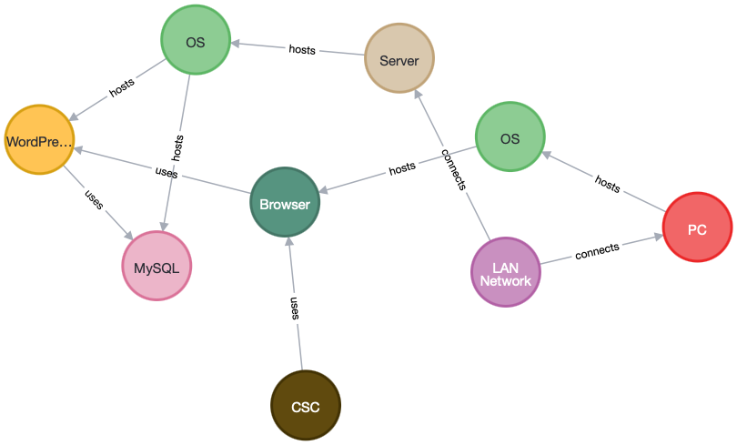

# Knowledge Bases Manager

## Overview

This repository contains a Jupyter Notebook that facilitates the generation and management of knowledge bases using various Python libraries and Neo4j. The notebook is designed to load, process, and visualize attack patterns (from [CAPEC](http://capec.mitre.org)) and threat catalogs, and integrate them into a Neo4j database for advanced querying and analysis.

## Features

- **Installation of Python Libraries**: Automatically installs required Python libraries from a `requirements.txt` file.
- **Data Loading**: Loads attack patterns and threat catalogs into Pandas DataFrames.
- **Data Processing**: Converts DataFrame columns to appropriate formats for compatibility with Neo4j.
- **Neo4j Integration**: Connects to a Neo4j database, clears existing data, and populates it with processed attack patterns and threat catalogs.
- **Graph Visualization**: Uses `yfiles_jupyter_graphs` to visualize the Capec graph and the enhanced MACM graph.
- **Interactive GUI**: Provides an interactive interface for searching and querying information in the Capec catalog.
- **Threat Model Building**: Reads and processes the MACM of the system under examination and integrates it with the attack patterns and threat catalogs.

## Usage

1. **Install Required Libraries**: Ensure all required libraries are installed by running the installation cell in the notebook.
2. **Load Data**: Load attack patterns and threat catalogs into DataFrames.
3. **Process Data**: Convert DataFrame columns to strings for compatibility with Neo4j.
4. **Connect to Neo4j**: Establish a connection to the Neo4j database.
5. **Populate Neo4j Database**: Clear existing data and populate the database with processed attack patterns and threat catalogs.
6. **Visualize Graphs**: Use the provided cells to visualize the Capec graph and the enhanced MACM graph.
7. **Interactive Search**: Utilize the interactive GUI to search and query the Capec catalog.
8. **Build Threat Model**: Read and process the MACM of the system under examination and integrate it with the attack patterns and threat catalogs.

## Example

An example MACM is provided (`Wordpress.macm`), representing a system model consisting of a WordPress web server that uses a relational database. Both services are hosted on virtual machines connected through a network.



## Requirements

- Python 3.13.0
- Jupyter Notebook
- Neo4j
- Required Python libraries (listed in `requirements.txt`). The installation of required libraries is already included in the first cell of the Jupyter Notebook. Simply run the first cell to install all necessary dependencies.

## Installation

1. Clone the repository:
    ```bash
    git clone https://github.com/yourusername/AttackGraphGen.git
    ```
2. Navigate to the repository directory:
    ```bash
    cd AttackGraphGen
    ```
3. Create a .env file with the following content:
    ```bash
    NEO4J_URI=bolt://localhost:7687
    NEO4J_USER=neo4j
    NEO4J_PASSWORD=yourpassword
    ```
    Replace `yourpassword` with the password you set for the Neo4j database.
4. Start using the Jupyter Notebook.

## License

This project is licensed under the Apache License 2.0.

## Acknowledgements

- The `capec_stix` folder contains a clone of the STIX version of CAPEC published by MITRE on GitHub, available at [https://github.com/mitre/cti](https://github.com/mitre/cti).